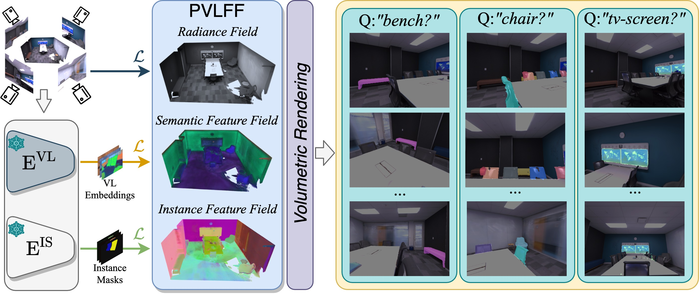

<h1 align="center">Panoptic Vision-Language Feature Fields</h1>

<p align="center">
<strong><a href="https://haoranchen1104.github.io/">Haoran Chen</a></strong>,
<strong><a href="https://keke.dev/">Kenneth Blomqvist</a></strong>,
<strong><a href="https://scholar.google.com/citations?user=qwSANZoAAAAJ&hl=en&oi=ao">Francesco Milano</a></strong>, <strong><a href="https://asl.ethz.ch/">Roland Siegwart</a></strong>
</p>

<h2 align="center">IEEE RA-L 2024</h2>
<h3 align="center"><a href="https://arxiv.org/abs/2309.05448">Paper</a> | <a href="https://www.youtube.com/watch?v=mZoujkg_axE">Video</a> | <a href="https://ethz-asl.github.io/pvlff/">Project Page</a></h3>

<p align="center">
  <a href="">
    
  </a>
</p>

Recently, methods have been proposed for 3D _open-vocabulary_ semantic segmentation. Such methods are able to segment scenes into arbitrary classes based on text descriptions provided during runtime. In this paper, we propose to the best of our knowledge the first algorithm for _open-vocabulary panoptic_ segmentation in 3D scenes. Our algorithm, Panoptic Vision-Language Feature Fields (PVLFF), learns a semantic feature field of the scene by distilling vision-language features from a pretrained 2D model, and jointly fits an instance feature field through contrastive learning using 2D instance segments on input frames. Despite not being trained on the target classes, our method achieves panoptic segmentation performance similar to the state-of-the-art _closed-set_ 3D systems on the HyperSim, ScanNet and Replica dataset and additionally outperforms current 3D open-vocabulary systems in terms of semantic segmentation. We ablate the components of our method to demonstrate the effectiveness of our model architecture. 

## Table of Contents

1. [Installation](#installation)
2. [Running experiments](#running-experiments)
3. [Citation](#citation)
4. [Acknowledgements](#acknowledgements)

## Installation

The installation instructions were tested for Python 3.8, 3.9 and 3.10. Some dependencies are recommended to be installed through Anaconda and we assume you are using an Anaconda environment for these instructions.

The software uses CUDA and compiling `tiny-cuda-nn` requires `nvcc`. If you don't have CUDA >= version 11.3, including `nvcc`, installed on your system, you can install it in your anaconda env with:
```
conda install -c conda-forge cudatoolkit-dev=11.4
```

To install PyTorch and ffmpeg, run:
```
conda install pytorch torchvision cudatoolkit=11.3 -c pytorch
conda install ffmpeg
```

Install into your desired Python environment with the following commands:
```
pip install git+https://github.com/NVlabs/tiny-cuda-nn/#subdirectory=bindings/torch

git submodule update --init --recursive
pushd torch_ngp
git submodule update --init --recursive
pip install -e .
bash scripts/install_ext.sh
popd

# To use LSeg features for vision-language feature fields.
git clone https://github.com/kekeblom/lang-seg
pushd lang-seg
pip install -e .
popd

# Finally install Autolabel.
pip install -e .
```


## Running experiments

### Data conversion

Follow the instructions in `docs/data.md` to convert the scenes from original datasets into the our format.

### Training
To begin the training process, first run the precomputing steps:

```
# Compute the vision-language features.
python scripts/compute_feature_maps.py <dataset-dir>/<scene> \
    --features lseg \
    --checkpoint <lseg-weights> \
    --dim 512

# Compute the instance masks using SAM.
python scripts/compute_sam_mask.py <dataset-dir>/<scene> \
    --sam-vit-h-checkpoint <sam-weights>
```

where `<dataset-dir>` is the path to the converted scenes, `<scene>` is the name of the scene. `<lseg-weights>` is the path to the LSeg checkpoint, `<sam-weights>` is the path to the SAM checkpoint (which can be downloaded [here](https://dl.fbaipublicfiles.com/segment_anything/sam_vit_h_4b8939.pth)).

Then, fit the scene representation using the following training script:
```
python scripts/train.py <dataset-dir>/<scene> \
    --batch-size 2048 \
    --iters 20000 \
    --workspace <workspace> \
    --feature-dim 512 \
    --features lseg \
    --contrastive \
    --sam-sampling <sampling-method> \
    --slow-center \
    --cluster-instance-features
```


where `<workspace>` is the folder where the model is saved. The flag `--contrastive` enables training the instance feature field using contrastive learning. The flag `--sam-sampling` sets the strategy to sample the SAM masks for training; the strategies include `proportional` and `uniform`, where `proportional` means sampling the masks according to their areas, and `uniform` means sampling these masks uniformly. The flag `--slow-center` enables the use of "slow center strategy". The flag `--cluster-instance-features` enables running the clustering after the training and saving the cluster centers together with the object instance of the HDBSCAN clustering class.

Here we provide some [checkpoints](https://doi.org/10.3929/ethz-b-000656499) trained on Replica scenes.

### Inference
Render the scene views after training by running the following script:
```
python scripts/render.py <dataset-dir>/<scene> \
    --stride 1 \
    --model-dir <model-dir> \
    --out <out-dir> \
    --checkpoint <lseg-weights> \
    --label-map <label-map>
```
where `<model-dir>` is the folder where the model checkpoint is saved (e.g. `<workspace>/<scene>/g15_hg+freq_lseg_rgb1.0_d0.1_s1.0_f0.5_c0.1`). `<out-dir>` sets the output folder where the rendered results are saved. `<label-map>` is the label mapping from id to semantic class of the scene (here is an example [label-map](./configs/label_map.csv) file that we used for replica scenes).

### Evaluation

Scene-level Panoptic Quality and 2D Semantic Segmentation
```
python scripts/language/evaluate.py <dataset-dir> \
    --vis <evaluation-folder/vis> \ # the folder to save the visualization results.
    --workspace <workspace> \
    --out <evaluation-folder> \ # the folder to save the evaluation results.
    --label-map <label-map> \
    --feature-checkpoint <lseg-weights> \
    --panoptic # the flag to evaluate scene-level PQ and 2D semantic segmentation.
#    --debug # whether to save the visualization images.    
```

3D Semantic Segmentation (only for ScanNet)
```
python scripts/language/evaluate.py <dataset-dir> \
    --vis <evaluation-folder/vis> \ # the folder to save the visualization results.
    --workspace <workspace> \
    --out <evaluation-folder> \ # the folder to save the evaluation results.
    --label-map <label-map> \
    --feature-checkpoint <lseg-weights> \
    --pc # the flag to 3D semantic segmentation.
```

### 3D interactive segmentation
We provide a demo UI script of interactive open-vocabulary segmentation on pointclouds of ScanNet scenes. 
```
python scripts/demo_ui.py <dataset-dir>/<scene> \
    --workspace <workspace> \
    --checkpoint <lseg-weights>
```

https://github.com/ethz-asl/pvlff/assets/33897834/1c31a03a-c7e9-43dc-af83-de1cf471893e

## Citation

If you find our code or paper useful, please cite:

```bibtex
@article{Chen2024PVLFF,
  author    = {Chen, Haoran and Blomqvist, Kenneth and Milano, Francesco and Siegwart, Roland},
  title     = {Panoptic Vision-Language Feature Fields},
  journal   = {IEEE Robotics and Automation Letters (RA-L)},
  volume    = {9},
  number    = {3},
  pages     = {2144--2151},
  year      = {2024}
}
```

## Acknowledgements

A large part of the code is based on [Autolabel](https://github.com/ethz-asl/autolabel):

- K. Blomqvist, L. Ott, J. J. Chung, and R. Siegwart, "Baking in the Feature: Accelerating Volumetric Segmentation by Rendering Feature Maps", in IEEE/RSJ International Conference on Intelligent Robots and Systems (IROS), 2023 - [Link](https://keke.dev/baking-in-the-feature)

- K. Blomqvist, F. Milano, J. J. Chung, L. Ott, and R. Siegwart, "Neural Implicit Vision-Language Feature Fields", in IEEE/RSJ International Conference on Intelligent Robots and Systems (IROS), 2023 - [Link](https://arxiv.org/abs/2303.10962)

Our code uses our customized version of [`torch-ngp`](https://github.com/ashawkey/torch-ngp) as the underlying NeRF framework. Big thanks to [Jiaxiang Tang](https://me.kiui.moe/) for releasing the initial implementation.
